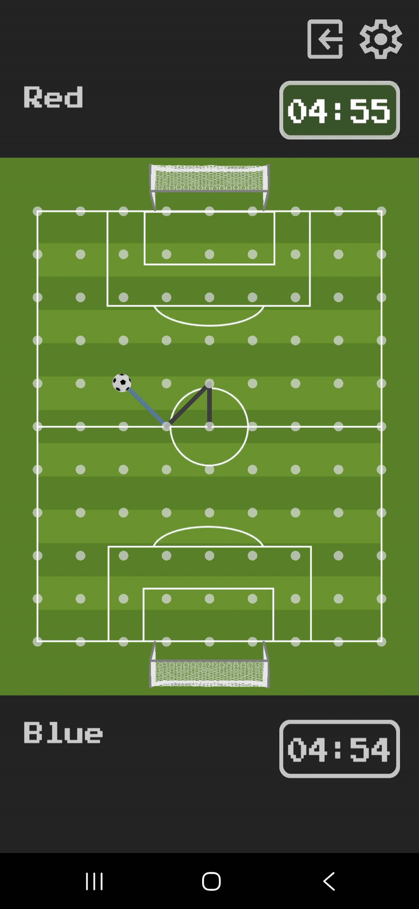

# SoccerLine

SoccerLine is a digital adaptation of the classic strategic pen-and-paper game "Paper Soccer." It transforms the traditional grid-based logic puzzle into an interactive mobile experience.

Players compete on a graph-based field, taking turns to move a soccer ball from one node to another. The core mechanic relies on graph theory: players can "bounce" off existing lines or field borders to gain extra moves, creating complex pathfinding strategies. The goal is to outmaneuver the opponent to reach their goal or create a blockage where the opponent has no valid moves left.

Download the latest Android beta (.apk) in the Releases section:
[Releases](https://github.com/mzabron/SoccerLineOnline/releases)

## Current Game Modes

### Local Competitive (PvP)
*   **Classic 1v1 Gameplay:** Hot-seat style multiplayer where two players trade turns on the same device.
*   **Customizable Settings:** Players can adjust match timers (or set unlimited time).
*   **Turn Logic:** Robust state management handles turn switching, timeout detection, and "bounce" mechanics.

### Interactive Tutorial
*   **Step-by-Step Learning:** A guided scenario inherited from the core game logic that teaches movement, bouncing, and winning conditions.
*   **Scripted Scenarios:** Uses a `TutorialLogicManager` that inherits from main mode LogicManager to override standard inputs and creating specific puzzle scenarios to teach basic mechanics.
*   **Visual Guides:** Features pulsing animations and hand-swipe indicators to guide new users.

## Preview

| Main Menu | Gameplay | Tutorial |
|-----------|-----------|-----------|
|  |  |  |

## Roadmap & Future Features

The development of **SoccerLine** is active. The following features are planned to expand the experience beyond local play:

*   **Single Player (vs AI):** A solo mode featuring an intelligent CPU opponent driven by pathfinding and decision-making algorithms (e.g., Minimax).
*   **Audio Implementation:** Complete sound design including SFX for ball movement, line drawing, goal scoring, and UI interactions, as well as background music.
*   **Online Multiplayer:** Global matchmaking system that pairs players based on skill rating (ELO) for competitive ranked matches.
*   **Social System:** Friend lists, direct game invites, and global leaderboards.
*   **Platform Integration:** Seamless login via **Google Play Games** to support cloud saves, persistent player profiles, and achievements.
*   **Store Release:** Official launch and distribution on the **Google Play Store**.

## Tech Stack

### Engine & Core
*   **Unity (2022 LTS):** Core engine.
*   **C#:** Primary scripting language.
*   **Graph/Grid Logic:** Custom `Node` and grid system managing connection states (N, S, E, W, and diagonals).

### Input & Systems
*   **New Input System:** Touch swipes and mouse clicks handled via `UnityEngine.InputSystem`.
*   **Mathematical Logic:** Vector mathematics used for swipe detection boundaries (calculating angles for 8-directional movement).
*   **Data Persistence:** `PlayerPrefs` used for storing game settings and player profiles.

### Visuals & UI
*   **Procedural Rendering:** `LineRenderer` is used to dynamically draw the path of the ball in real-time.
*   **Tweening/Animation:** Custom coroutine-based animations for UI fading, line drawing, and object pulsing.
